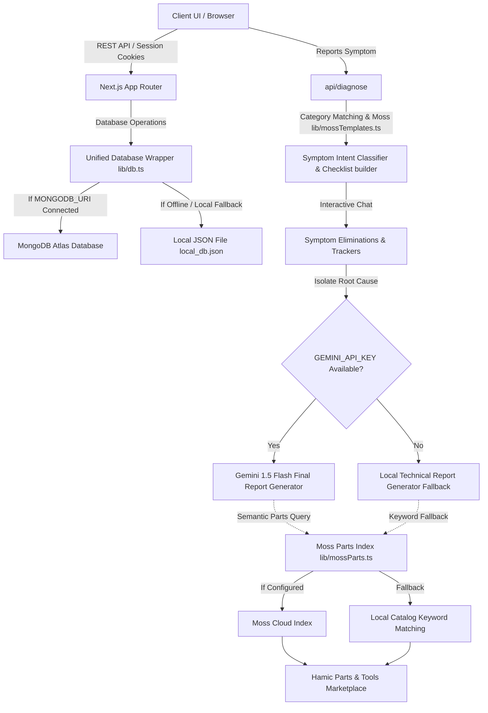

# HAMIC — Intelligent Product Support & Hybrid Diagnostic System

**Team Name**: _[Insert Team Name]_  
**Team Members**: _[Insert Team Members]_

Hamic is an intelligent, high-performance product support and troubleshooting platform designed to bridge the gap between complex industrial or consumer hardware manuals and human-friendly diagnostic resolutions.

By leveraging a dual-mode hybrid persistence layer, **Moss Semantic Search** indexing, and **Gemini AI (1.5 Flash)** reasoning, Hamic delivers sub-second symptom classification, context-grounded step-by-step troubleshooting, and instant links to a dedicated tools and spare parts marketplace.

---

## 🏗️ Technical Architecture

Hamic is designed to be highly resilient, transitioning seamlessly between MongoDB Atlas cloud hosting and local filesystem fallbacks. The system's architecture and diagnostic flow are illustrated below:



---

## ⚡ Key Features

1. **Self-Healing Seeder**: Checks MongoDB Atlas and the local JSON file on database initialization. If empty, it automatically seeds matching products, accounts, and manuals with uniform IDs, preventing documentation loss during authentication transitions.
2. **Category-Scoped Diagnostics**: Restricts symptom checklists to their parent product category (e.g. ACs vs Washing Machines), preventing cross-product symptom contamination.
3. **Moss Semantic Intent Classifier**: Routes user symptoms (e.g., _"washing machine vibrating violently"_) to custom troubleshooting checklists in under 10ms.
4. **Actionable AI Reports**: Generates professional, warm, safety-conscious diagnostic summaries using Gemini AI, grounded in retrieved manual documentation and linked directly to Hamic's Marketplace.
5. **Parts & Tools Marketplace**: A unified storefront to browse, search, and buy recommended spare parts, tools, and consumables. Features store listings (Amazon, Home Depot, Hamic Depot), compatibility details, and a simulated checkout flow.
6. **Maintenance Calendars**: Allows users to claim product ownership, automatically parse recommended maintenance intervals from manuals, and track schedules.
7. **Serverless Production-Ready**: Caches connection pooling via Mongoose `readyState` and bypasses local file-writes on read-only environments to run flawlessly on Vercel.

---

## 🛠️ Tech Stack Used

- **Framework**: Next.js (App Router, Server Actions, API Routes)
- **Primary Database**: MongoDB Atlas (with Mongoose ORM)
- **Local Fallback**: Custom Local JSON Database (`local_db.json`)
- **Semantic Search Engine**: [Moss Search SDK](https://moss.dev)
- **Large Language Model**: Google Gemini 1.5 Flash (via `@google/generative-ai`)
- **Styling**: Tailwind CSS & Lucide Icons (Vanilla Dark Mode theme)
- **Language**: TypeScript

---

## 🧠 How Moss is Used in Hamic

Hamic integrates the **Moss Search SDK** across two core diagnostic modules:

### 1. Symptom Intent Template Classifier (`lib/mossTemplates.ts`)

When a user types a symptom (e.g., _"air conditioner blowing hot air"_), Hamic queries the `hamic-support-docs` index. Moss classifies the user's intent and maps it to a specific structured diagnostic checklist (e.g. `cooling` or `spinning`) in under 10ms. If Moss is unavailable or limits are reached, the system falls back to category-based matching.

### 2. Spare Parts Retrieval RAG (`lib/mossParts.ts`)

Once the troubleshooting assistant isolates the root cause (e.g., _"unbalanced load"_ or _"refrigerant leak"_), Moss semantic query searches the parts catalog. It retrieves highly relevant tools (like a multimeter or socket wrench) and spare parts (like a drive belt or HEPA filter) matching the isolated cause and links them directly to the storefront.

---

## ⚙️ Setup and Installation Instructions

### Prerequisites

- [Node.js](https://nodejs.org) (v18.x or later recommended)
- A MongoDB Atlas connection string (Optional; falls back to local file database if not provided)
- A Gemini API Key (Optional; falls back to local diagnostic compiler if not provided)
- Moss Project ID & Key (Optional; falls back to keyword matching if not provided)

### 1. Install Dependencies

```bash
npm install
```

### 2. Configure Environment Variables

Create a `.env.local` file in the root directory and add the following keys:

```env
# JWT Secret for cookie authentication
JWT_SECRET=your-secure-jwt-secret-key-2026

# Paste your MongoDB Atlas URI here (Leave blank for local JSON fallback)
MONGODB_URI="mongodb+srv://<user>:<password>@cluster.mongodb.net/hamic"

# Paste your Gemini API key (From Google AI Studio)
GEMINI_API_KEY="AIzaSy..."

# Moss credentials (From moss.dev)
MOSS_PROJECT_ID="your-moss-project-id"
MOSS_PROJECT_KEY="your-moss-project-key"
```

### 3. Run the Development Server

```bash
npm run dev
```

Open [http://localhost:3000](http://localhost:3000) to access the application.

---

## 📖 Usage Guide

### 1. Test Credentials

Thanks to Hamic's self-healing seeder, you can log in instantly with these pre-seeded accounts:

- **Company Creator Account**: `company@hamic.com` (password: `company123`)
- **Standard User Account**: `user@hamic.com` (password: `user123`)

### 2. Troubleshooting Products

1. Navigate to **Marketplace** (`/products`) and click **Troubleshoot** on `WashMaster Pro` or `Acme Air Conditioner`.
2. Go to the **Diagnostic Assistant** tab and input a symptom.
3. Answer the guided questions. When the issue is isolated, review the Gemini-generated final report.
4. Click on the recommended spare parts or tools in the sidebar to open them in the Marketplace.

### 3. Parts Marketplace

1. Click **Parts & Tools** in the navbar to open the Marketplace storefront.
2. Filter by type (Spare Part, Tool, Consumable) or category.
3. Click **Buy Now** to see authorized retailer links (Amazon, Home Depot), check device compatibility, and simulate checkout.

---

## 🖼️ Screenshots & Demos

### Screenshots

_(Screenshots will be uploaded here)_

### Demo Video Link

_([Demo video link will be inserted here](https://drive.google.com/file/d/1u8KFNXnqxW_AHZwXp0gR6ynqojOH0cyJ/view?usp=sharing))_
